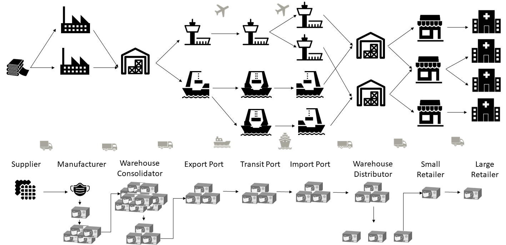
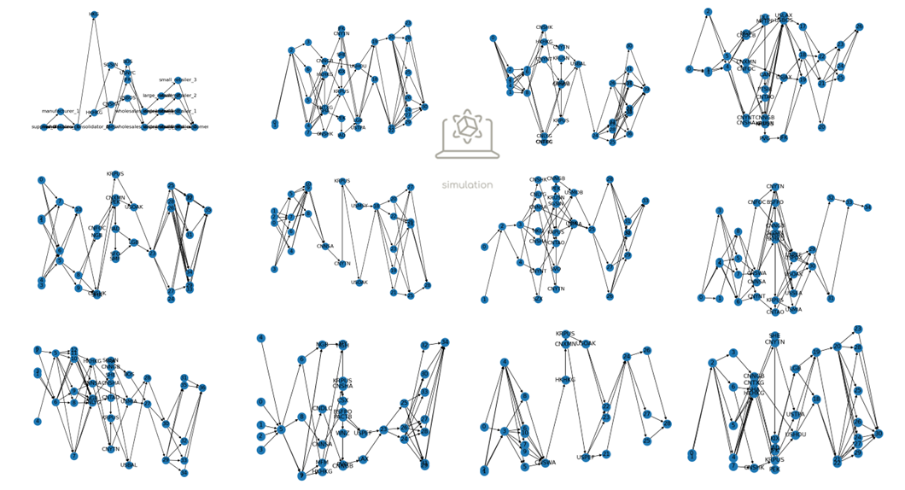

Complex Stylized Supply Chain Model - Automatic Graph Generator
==========================================================================================================
This repository present a complex stylized supply chain discrete event simulation model of a counterfeit Personal Protective Equipment (PPE) supply chain.
The ground truth model is based on the following figure:

|
Additionally, this repository presents scripts for automatically generating a discrete event simulation model from a networkx graph.
The generation of a large set of randomly generated networkx graphs based on real-world data, which can be automatically ran as a simulation model, is also presented. This contributes to research on structural uncertainty in models.
This code is an extension of the `Master Thesis of Bruno Hermans <https://repository.tudelft.nl/record/uuid:e19d2957-eb33-4171-8dc1-8053de3d9e1c>`_ , Delft University of Technology.
An example of the various graph structures that this repository can generate is shown in the following figure:

|
As counterfeit PPE is a case study, this repository can be used for any other supply chain case study.

The simulation models are developed in `pydsol-core <https://github.com/averbraeck/pydsol-core>`_ and `pydsol-model <https://github.com/imvs95/pydsol-model>`_ .
For the real-world data, we use the repository  `port_data_graphs <https://github.com/imvs95/port_data_graphs>`_ to create various graph structures based on open-source data.

This repository is also part of the Ph.D. thesis of  `Isabelle M. van Schilt <https://www.tudelft.nl/staff/i.m.vanschilt/?cHash=74e749835b2a89c6c76b804683ffbbcf>`_, Delft University of Technology.
The simulation model is used in the following repositories: structure_calibration_sparse_data <https://github.com/imvs95/structure_calibration_sparse_data>`_ & quality_diversity_sparse_data <https://github.com/imvs95/quality_diversity_sparse_data>`_.

Content
=====================================================
The following folders can be found in this repository:

* *data*: Data for follow-up analysis of the simulation model, such as time series and KPIs. This folder also includes data on the ground truth graph, and the large set of graphs. This data is used for the analysis in the Ph.D. thesis. Large data files upon request.
* *input*: Input data for graph generator, such as the real-world data and the parameters for the graph generator. Large input files upon request.
* *sim_model_elements*: Scripts for individual elements of the simulation model, such as the vehicles, suppliers, ports etc.
* *structural_model_composer*: Scripts for generating various random graphs, and combine these graphs with the real-world port data.
* *utils*: Scripts for helper functions, such as aggregating statistics, configure input data of the simulation model elements, and creating the ground truth graph.

The following files can be found in this repository:

* *complex_toy_model_graph.py*: DSOL simulation model, automatically generated from a synthetic graph.
* *run_model.py*: Script to run the simulation model of a synthetic graph.
* *RunnerObject.py*: Wrapper to run the simulation model.
|
* *complex_toy_model_graph_generator_airsea.py*: DSOL simulation model, automatically generated from a graph with real-world data for sea and airports.
* *run_model_generator_airsea.py*: Script to run the simulation model of a graph with real-world data on sea and airports.
* *RunnerObject_generator.py*:Wrapper to run the simulation model.
|
* *run_model_generator_airsea_qd.py*: Script to run the simulation model of a graph with real-world data on sea and airports, specifically for the quality diversity algorithm. This means that all input parameters are part of the function.
* *RunnerObject_generator_qd.py*: Wrapper to run the simulation model for quality diversity.
|
* *run_model_generator_airsea_mp.py*: Script to run the simulation model of a graph with real-world data on sea and airports for multiprocessing.
* *run_model_generator_mp_single_function_airsea.py*: Single function to run the simulation model for multiprocessing.
* *RunnerObject_generator_mp.py*: Wrapper to run the simulation model for multiprocessing.

Installing Requirements
=====================================================
Use the *requirements.txt* file to install the required packages. To install the packages, use the following command::

    pip install -r requirements.txt

